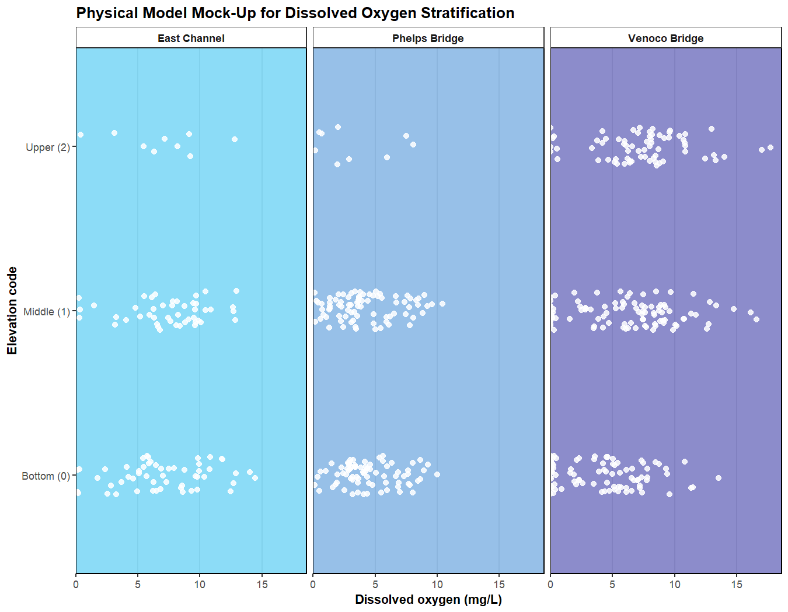
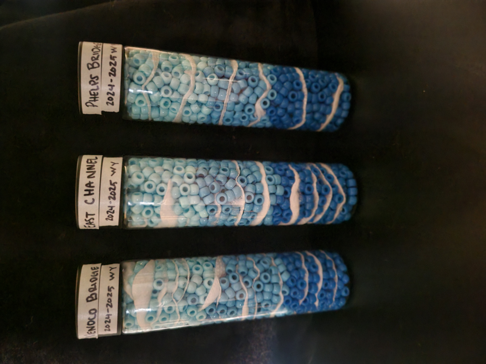

# ENVS 193DD Final Project

**Spring 2026**

## General information

This repository contains the final project for the Water Warriors group in ENVS 193DD. The project analyzes dissolved oxygen patterns in NCOS water quality monitoring data.

Group members:

- Phoebe Dupa
- Rebecca Martinez
- Shucan Zhao

The main questions are:

- How does dissolved oxygen differ across East Channel, Phelps Bridge, and Venoco Bridge?
- How does dissolved oxygen stratification differ across elevation-code measurement positions within each site?

To run the code in this repository, the following packages are needed:

```
library(tidyverse)
library(janitor)
library(here)
library(lubridate)
library(rstatix)
library(gt)
```

## Repository structure


```
.
├── ENVS-193DD-Final_Project.Rproj
├── README.md
├── code
│   ├── ecology.csl
│   ├── final_paper.pdf
│   ├── final_paper.qmd
│   ├── final_visual_draft.pdf
│   ├── final_visual_draft.qmd
│   ├── references.bib
│   ├── Visualization_Draft.pdf
│   ├── Visualization_Draft.qmd
│   ├── visual_draft-3.pdf
│   ├── visual_draft-3.qmd
│   ├── visual_draft_2.pdf
│   └── visual_draft_2.qmd
├── data
│   ├── NCOS_YSI_Water_Quality_Monitoring_0.csv
│   ├── NOAA-weather-data.csv
│   └── YSI_Data_Begin_1.csv
└── images
    ├── do_across_sites.png
    ├── do_elevation_profile_by_site.png
    ├── do_stratification_by_site.png
    ├── do_time_exploration.png
    ├── median_do_through_time_by_elevation.png
    ├── mockup_plot.png
    └── temp_time_exploration.png
```


### Code and output files

- `ecology.csl`: Citation style file used for formatting references.
- `final_paper.pdf`: Rendered PDF version of the final paper.
- `final_paper.qmd`: Quarto file for the final paper.
- `final_visual_draft.pdf`: Rendered PDF version of the final visualization draft.
- `final_visual_draft.qmd`: Final visualization draft used to develop the figures and statistical analysis.
- `references.bib`: Bibliography file for the final paper.
- `Visualization_Draft.pdf`: Rendered PDF version of Shucan’s visualization draft.
- `Visualization_Draft.qmd`: Shucan’s visualization draft.
- `visual_draft-3.pdf`: Rendered PDF version of Phoebe’s visualization draft.
- `visual_draft-3.qmd`: Phoebe’s visualization draft.
- `visual_draft_2.pdf`: Rendered PDF version of the earlier visualization draft.
- `visual_draft_2.qmd`: Earlier visualization draft.

### Data files

The project uses three datasets:

- `NCOS_YSI_Water_Quality_Monitoring_0.csv`: metadata for each water quality survey, including site name, monitoring date, weather notes, and location information
- `YSI_Data_Begin_1.csv`: water quality measurements collected during each survey, including dissolved oxygen, temperature, salinity, conductivity, and elevation code
- `NOAA-weather-data.csv`: daily weather data, including precipitation, maximum temperature, and minimum temperature

## Image files

The `images` folder contains figures and visual outputs used in the final paper, visualization drafts, and elective model planning.

- `do_across_sites.png`: Final paper figure showing dissolved oxygen across the three NCOS sites.
- `do_stratification_by_site.png`: Final paper figure showing dissolved oxygen across elevation-code positions within each site.
- `do_elevation_profile_by_site.png`: Final paper figure showing dissolved oxygen elevation profiles by site.
- `median_do_through_time_by_elevation.png`: Final paper figure showing median dissolved oxygen through time by elevation code and site.
- `do_time_exploration.png`: Exploratory dissolved oxygen time-series figure.
- `temp_time_exploration.png`: Exploratory temperature time-series figure.
- `mockup_plot.png`: Visual mock-up used to guide the physical elective model.

## Project workflow

The project includes:

- cleaning the metadata, water quality, and weather datasets
- joining metadata and water quality measurements by survey ID
- joining weather data by date
- filtering to East Channel, Phelps Bridge, and Venoco Bridge
- filtering to the 2024 and 2025 water years
- filtering to elevation codes 0, 1, and 2
- summarizing dissolved oxygen by site and by site/elevation-code combinations
- calculating stratification difference as upper median dissolved oxygen minus bottom median dissolved oxygen
- visualizing dissolved oxygen across sites, elevation codes, elevation profiles, and sampling dates
- testing site-level dissolved oxygen differences with a Kruskal-Wallis test
- using Dunn post-hoc tests for pairwise site comparisons when the Kruskal-Wallis test was significant
- testing within-site elevation-code differences with separate Kruskal-Wallis tests
- using Dunn post-hoc tests for elevation-code comparisons at Venoco Bridge
- calculating effect sizes to describe the strength of the patterns

## Rendered output

- [Final paper](https://github.com/shucanzhao/ENVS-193DD-Final_Project/blob/main/code/final_paper.pdf)
- [Final visual draft](https://github.com/shucanzhao/ENVS-193DD-Final_Project/blob/main/code/final_visual_draft.qmd)
- [Visual draft 2](https://github.com/shucanzhao/ENVS-193DD-Final_Project/blob/main/code/visual_draft_2.pdf)
- [Visual draft 3](https://github.com/shucanzhao/ENVS-193DD-Final_Project/blob/main/code/visual_draft-3.pdf)
- [Visualization draft](https://github.com/shucanzhao/ENVS-193DD-Final_Project/blob/main/code/Visualization_Draft.pdf)


## Project roles

- Natural history/framing director: Phoebe Dupa
- Stats and visualization director: Rebecca Martinez
- GitHub/code director: Shucan Zhao


## Elective

For the elective portion of the project, the group created a physical visual model to represent dissolved oxygen stratification across the three NCOS sites: East Channel, Phelps Bridge, and Venoco Bridge.

The model uses three clear containers, with each container representing one NCOS site. Blue beads represent the water column, and cotton represents relative dissolved oxygen. More cotton represents higher dissolved oxygen, while less cotton represents lower dissolved oxygen. The model is organized by bottom, middle, and upper measurement positions to show how dissolved oxygen can differ within the water column.

The mock-up below was used to plan how the physical model would represent each site and elevation-code position.



The completed advanced elective model is shown below.



## Repository links

- [Final project repository](https://github.com/shucanzhao/ENVS-193DD-Final_Project): Contains the final paper, visualization drafts, data, figures, and README for the NCOS dissolved oxygen project.
- [Project proposal repository](https://github.com/shucanzhao/project-proposal): Contains the original project proposal and early planning materials for the final project.
- [Literature dissection repository](https://github.com/shucanzhao/literature-dissection): Contains the literature review materials and background sources used to frame the final project.
