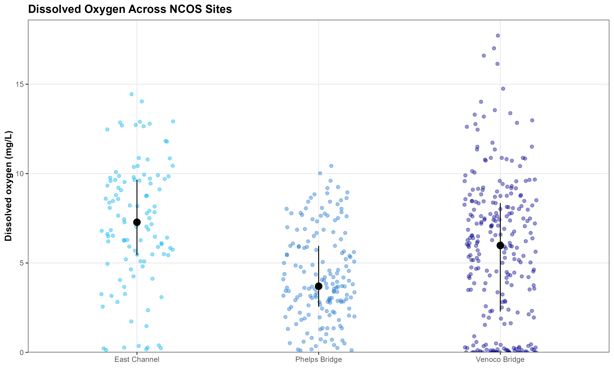
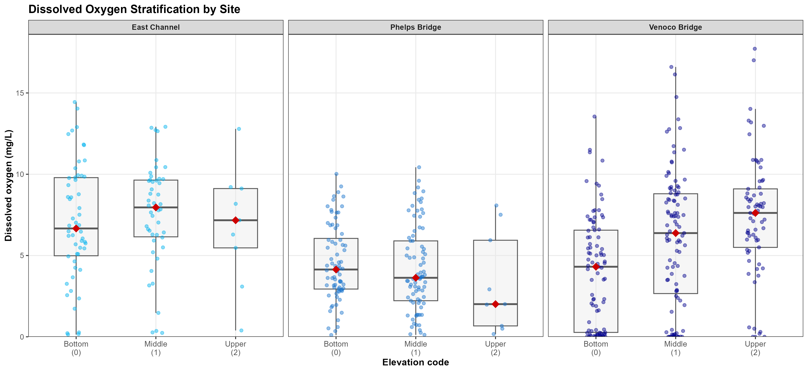
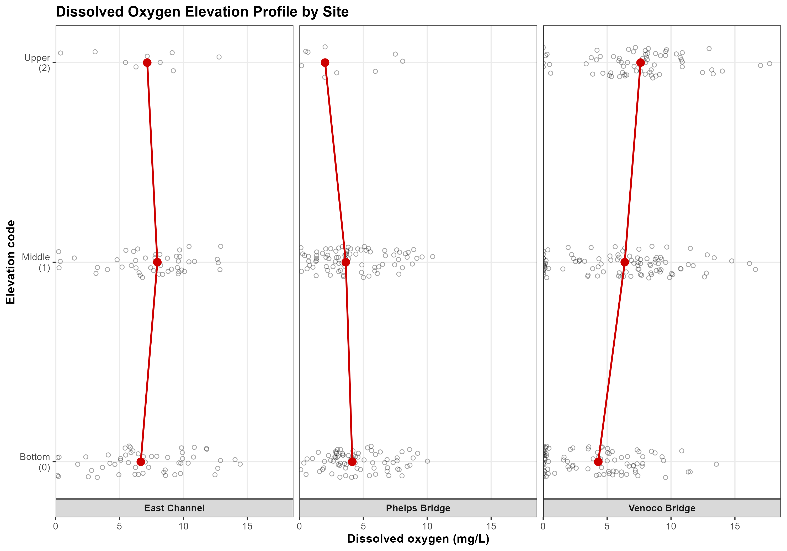
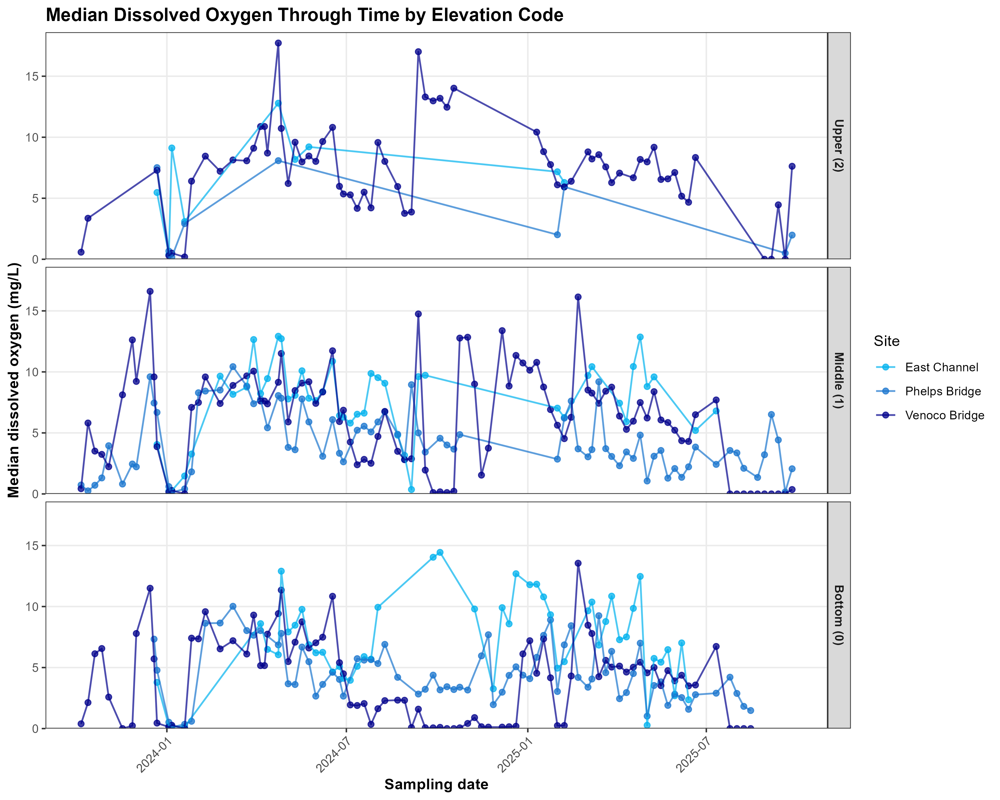

# Introduction

North Campus Open Space (NCOS) is a restored wetland connected to the Devereux Slough system in Goleta, California. The site includes several channels, bridges, and wetland areas, so water quality may differ across the system. The North Campus Open Space Restoration Project Monitoring Report provides background on restoration progress and monitoring at the site [@rickard2024]. At a restored wetland like NCOS, water quality monitoring helps show how conditions vary across different parts of the system.

Dissolved oxygen is a useful water quality measurement because it shows how much oxygen is available in the water for aquatic organisms. In shallow wetlands and estuaries, dissolved oxygen can vary by location, season, time of day, and depth in the water column. These patterns can be influenced by water movement, temperature, salinity, vegetation, photosynthesis, respiration, and decomposition [@gale2006; @nezlin2009]. These oxygen conditions are also tied to habitat quality. Low dissolved oxygen can reduce the suitability of wetland and marsh habitats for fish and other nekton [@clark2025; @smith2003]. Low oxygen near the bottom of shallow wetlands can also affect decomposition and where invertebrates are active in the water column [@vanderlee2017]. For these reasons, dissolved oxygen can be used as an indicator of water quality and aquatic habitat conditions.

Research from other wetland and estuary systems helps explain why both site and depth are important to examine. In the Carmel River Lagoon, a Central California bar-built estuary, dissolved oxygen varied across different branches of the lagoon as mouth state and hydrologic conditions changed [@dawson2023]. That pattern is relevant to NCOS because East Channel, Phelps Bridge, and Venoco Bridge are different locations within the same coastal wetland system. Other studies show that shallow lagoons and estuaries can develop vertical differences in dissolved oxygen when mixing is limited. Under these conditions, bottom water can become lower in oxygen while surface water remains more oxygenated [@gale2006; @nezlin2009]. Together, these studies provide a basis for looking at both site-level differences and vertical differences in dissolved oxygen at NCOS.

The analysis focuses on three NCOS sites: East Channel, Phelps Bridge, and Venoco Bridge. These sites represent different parts of the wetland and may differ in water movement, depth, vegetation, salinity, and connection to other parts of the slough. Within each site, elevation code is used to examine possible DO stratification, where codes 0, 1, and 2 correspond to bottom, middle, and upper measurements, respectively.

This study asks two main questions:

1. How does dissolved oxygen differ across East Channel, Phelps Bridge, and Venoco Bridge?
2. How does dissolved oxygen stratification differ across elevation-code measurement positions within each site?

# Methods

This analysis used NCOS water quality monitoring data from the 2024 and 2025 water years. Sampling was conducted on a regular schedule throughout the 2024 and 2025 water years. Each site was sampled approximately weekly, so that dissolved oxygen at each site is represented by many measurements across both wet and dry seasons. The analysis focused on three main sites: East Channel, Phelps Bridge, and Venoco Bridge. These sites were selected because they represent different parts of the wetland system and had enough dissolved oxygen measurements to compare. The North Campus Open Space Restoration Project Monitoring Report provides background on the restoration project and monitoring at the site [@rickard2024].

The analysis used NCOS water quality monitoring metadata and YSI water quality measurements. The metadata included survey information such as site name, monitoring date, weather notes, water year, and location information. The YSI dataset included water quality measurements such as dissolved oxygen, temperature, salinity, conductivity, and elevation code. NOAA weather data were also available and provided temporal context for the monitoring dates.

The metadata and YSI water quality data were cleaned and joined so that each dissolved oxygen measurement was connected to the correct site, date, water year, and elevation-code position. The final dissolved oxygen dataset was filtered to include East Channel, Phelps Bridge, and Venoco Bridge during the 2024 and 2025 water years. The dataset was also filtered to elevation codes 0, 1, and 2, which represented bottom, middle, and upper measurements, respectively.

Dissolved oxygen, measured in milligrams per liter, was the main response variable. Site was used to compare dissolved oxygen across the three NCOS locations, and elevation code was used to compare dissolved oxygen across bottom, middle, and upper measurement positions within each site. Descriptive statistics were calculated before statistical testing. Dissolved oxygen was summarized by site and by site/elevation-code combinations using mean, median, first quartile, third quartile, standard deviation, variance, and sample size. Stratification difference was also calculated for each site as upper median dissolved oxygen minus bottom median dissolved oxygen. Positive values indicated that median dissolved oxygen was higher at the upper measurement position than at the bottom measurement position.

Figures were created to show dissolved oxygen across sites, dissolved oxygen across elevation codes within each site, median dissolved oxygen elevation profiles, and median dissolved oxygen through time by elevation code and site. Kruskal-Wallis tests were used to compare dissolved oxygen across groups. For the first question, a Kruskal-Wallis test compared dissolved oxygen across East Channel, Phelps Bridge, and Venoco Bridge. When that result was significant, Dunn post-hoc tests were used to compare site pairs. For the stratification question, separate Kruskal-Wallis tests were run within each site to compare dissolved oxygen across elevation codes. When a within-site result was significant, Dunn post-hoc tests were used to compare elevation-code pairs. Effect sizes were also calculated to describe the strength of the patterns.

The dataset included repeated monitoring observations across sampling dates rather than continuous dissolved oxygen sensor measurements. As a result, the analysis shows patterns across sites, elevation codes, and sampling dates, but it does not capture all short-term changes that may happen within a day.

# Results

Dissolved oxygen differed across the three NCOS sites. East Channel had a mean dissolved oxygen value of 7.22 mg/L and a median of 7.28 mg/L. Phelps Bridge had a mean of 4.30 mg/L and a median of 3.70 mg/L. Venoco Bridge had a mean of 5.68 mg/L and a median of 5.98 mg/L. The middle 50% of dissolved oxygen values ranged from 5.44 to 9.65 mg/L at East Channel, 2.56 to 5.96 mg/L at Phelps Bridge, and 2.29 to 8.35 mg/L at Venoco Bridge.

```{r}
#| label: fig-do-across-sites
#| fig-cap: "Dissolved oxygen across East Channel, Phelps Bridge, and Venoco Bridge. Individual points represent dissolved oxygen observations. Larger black points represent site medians, and vertical ranges show the first to third quartile range."
#| fig-align: center
#| out-width: "85%"
#| fig-pos: "H"


```

@fig-do-across-sites presents dissolved oxygen values across East Channel, Phelps Bridge, and Venoco Bridge. East Channel had the highest median dissolved oxygen, Phelps Bridge had the lowest median dissolved oxygen, and Venoco Bridge had the widest spread of values.

A Kruskal-Wallis test showed a significant difference in dissolved oxygen across sites, $\chi^2$ = 45.67, df = 2, p < 0.001. Dunn post-hoc tests showed that all three site pairs were significantly different after adjustment: East Channel and Phelps Bridge, East Channel and Venoco Bridge, and Phelps Bridge and Venoco Bridge. The effect size for the site comparison was $\eta^2_H$ = 0.083, which was classified as moderate.

Median dissolved oxygen values also varied across elevation-code positions within each site. At East Channel, median dissolved oxygen was 6.66 mg/L at the bottom, 7.96 mg/L in the middle, and 7.17 mg/L at the upper position. At Phelps Bridge, median dissolved oxygen was 4.14 mg/L at the bottom, 3.63 mg/L in the middle, and 2.01 mg/L at the upper position. At Venoco Bridge, median dissolved oxygen was 4.31 mg/L at the bottom, 6.38 mg/L in the middle, and 7.62 mg/L at the upper position.

```{r}
#| label: fig-do-stratification
#| fig-cap: "Dissolved oxygen across bottom, middle, and upper elevation-code positions within each site. Boxplots show dissolved oxygen distributions, points show individual observations, and red diamonds show median values."
#| fig-align: center
#| out-width: "100%"
#| fig-pos: "H"


```

@fig-do-stratification presents the distribution of dissolved oxygen values by elevation code within each site. The figure shows the clearest separation among elevation-code positions at Venoco Bridge.

Stratification difference was calculated as upper median dissolved oxygen minus bottom median dissolved oxygen. East Channel had a stratification difference of 0.50 mg/L. Phelps Bridge had a stratification difference of -2.13 mg/L. Venoco Bridge had a stratification difference of 3.31 mg/L.

```{r}
#| label: fig-do-elevation-profile
#| fig-cap: "Dissolved oxygen elevation profiles by site. Points show individual dissolved oxygen observations, red points show median values, and red lines connect median values across elevation codes."
#| fig-align: center
#| out-width: "85%"
#| fig-pos: "H"


```

@fig-do-elevation-profile shows the median dissolved oxygen elevation profile for each site. Venoco Bridge had the strongest bottom-to-upper increase in median dissolved oxygen, while East Channel and Phelps Bridge showed smaller or less consistent elevation-code patterns.

Within-site Kruskal-Wallis tests showed no significant dissolved oxygen difference across elevation codes at East Channel, $\chi^2$ = 1.11, df = 2, p = 0.574. Phelps Bridge also did not show a significant difference across elevation codes, $\chi^2$ = 3.02, df = 2, p = 0.221. Venoco Bridge showed a significant difference across elevation codes, $\chi^2$ = 28.64, df = 2, p < 0.001.

Because Venoco Bridge had a significant Kruskal-Wallis result, Dunn post-hoc tests were used to compare elevation-code pairs at that site. All three elevation-code pairs were significantly different after adjustment: bottom and middle, bottom and upper, and middle and upper. The effect size for the Venoco Bridge elevation-code comparison was $\eta^2_H$ = 0.105, which was classified as moderate.

```{r}
#| label: fig-do-through-time
#| fig-cap: "Median dissolved oxygen through time by elevation code and site. Points represent median dissolved oxygen for each sampling date and site, and lines connect values within each site."
#| fig-align: center
#| out-width: "90%"
#| fig-pos: "H"


```

@fig-do-through-time presents median dissolved oxygen through time by elevation code and site. Median dissolved oxygen values varied across sampling dates, sites, and elevation codes during the 2024 and 2025 water years.

Overall, dissolved oxygen differed across East Channel, Phelps Bridge, and Venoco Bridge. Dissolved oxygen differences across elevation codes were statistically significant at Venoco Bridge, but not at East Channel or Phelps Bridge.

# Discussion

The results show that dissolved oxygen conditions differed across the three NCOS sites. East Channel had the highest median dissolved oxygen, Phelps Bridge had the lowest median dissolved oxygen, and Venoco Bridge had the widest range of values (@fig-do-across-sites). Dissolved oxygen also differed by elevation code at Venoco Bridge, where median dissolved oxygen was lower at the bottom and higher at the middle and upper measurement positions (@fig-do-stratification; @fig-do-elevation-profile). East Channel and Phelps Bridge did not show significant dissolved oxygen differences across elevation codes.

These results show where dissolved oxygen differed, but they do not identify one clear cause. The three sites are in different parts of NCOS, and they likely differ in water movement, vegetation, depth, salinity, and connection to other parts of the slough. Any of these factors could affect dissolved oxygen, but this analysis did not directly test which factor was most important. Because of that, the results should be interpreted as evidence of site-level and elevation-code differences in dissolved oxygen, not as proof of what caused those differences.

The site-level pattern is useful because dissolved oxygen often varies within coastal wetland and lagoon systems. In the Carmel River Lagoon, dissolved oxygen varied across different branches of the estuary as hydrologic conditions and mouth state changed [@dawson2023]. Water quality in intermittently closed and open lagoons can also change with ocean connection, opening events, and mixing [@mayjor2023]. These studies support the idea that different parts of the same coastal wetland system can have different dissolved oxygen conditions.

The Venoco Bridge pattern also fits with research on vertical dissolved oxygen differences in shallow lagoons and estuaries. When water is not fully mixed, bottom water can become lower in oxygen while upper water remains more oxygenated [@gale2006; @nezlin2009]. In this project, Venoco Bridge showed the clearest bottom-to-upper difference in dissolved oxygen. This could reflect stronger stratification at that site, but additional data on depth, salinity, water movement, and timing would be needed to confirm that.

Dissolved oxygen matters because it is connected to aquatic habitat conditions. Low dissolved oxygen can reduce habitat suitability for fish and other nekton in marsh and wetland systems [@clark2025; @smith2003]. Oxygen conditions can also affect decomposition pathways and where invertebrates are active in shallow wetlands [@vanderlee2017]. This project did not measure fish, invertebrate responses, or decomposition, so it cannot make conclusions about biological effects. It can only show that dissolved oxygen conditions differed across the study sites and measurement positions.

Other variables could help explain the dissolved oxygen patterns in this dataset. Temperature is relevant because warmer water holds less oxygen and can also increase biological respiration. Salinity is relevant because salinity differences can affect water density and mixing. Both temperature and salinity were included in the YSI water quality data. Weather variables, such as air temperature and precipitation, were included in the NOAA dataset and can provide context for changes across sampling dates. Other variables, such as water depth, vegetation, algae, wind, turbidity, and connection to the ocean or slough mouth, may also influence dissolved oxygen, but they would require additional field observations or more detailed site data.

One limitation of this analysis is that the dataset used repeated monitoring observations rather than continuous dissolved oxygen sensor data. This means the analysis shows patterns across the available sampling dates, sites, and elevation codes, but it does not capture all short-term changes within a day. Dissolved oxygen in shallow wetlands can change over daily cycles because of light, photosynthesis, respiration, and temperature [@koopjakobsen2019; @smith2003; @reeder2011]. Time of day and sampling conditions could therefore affect the dissolved oxygen values measured during monitoring.

Collecting dissolved oxygen data in a restored wetland also has practical challenges. Wetland conditions can change with water level, weather, vegetation, mud, and site access. Measurements also depend on reaching similar locations and water-column positions across sampling dates. These challenges matter because small differences in sampling depth, timing, or field conditions could affect dissolved oxygen values. The NCOS monitoring report provides the broader restoration and monitoring context for interpreting these water quality patterns at the site [@rickard2024].

In addition, the elevation-code comparisons pooled measurements collected on many different dates, so the within-site differences reflect both vertical position and the conditions on each sampling date, rather than stratification measured at a single moment. Comparing bottom and upper DO from the same sampling event would give a more direct measure of stratification.

Future work could build on this analysis by comparing dissolved oxygen more directly with temperature, salinity, water depth, season, and time of day. Continuous dissolved oxygen sensors would also help show daily oxygen cycles that repeated monitoring may miss. These additions would make it easier to determine whether the patterns observed here are related to mixing, stratification, seasonal change, or other site conditions.

# Conclusion

Dissolved oxygen differed across East Channel, Phelps Bridge, and Venoco Bridge during the 2024 and 2025 water years. East Channel had the highest median dissolved oxygen, Phelps Bridge had the lowest median dissolved oxygen, and Venoco Bridge had the widest range of values.

Dissolved oxygen differences across elevation-code positions were strongest at Venoco Bridge. At this site, median dissolved oxygen was lower at the bottom and higher at the middle and upper measurement positions. East Channel and Phelps Bridge did not show significant dissolved oxygen differences across elevation codes.

These findings show that dissolved oxygen conditions were not the same across all parts of NCOS. Continued monitoring, especially with added attention to temperature, salinity, water depth, season, and time of day, could help explain what drives these differences across the restored wetland.


# References
